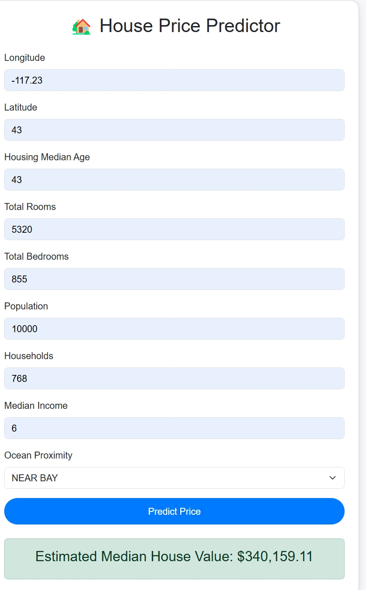

# 🏡 House Price Prediction Flask App

A simple web application to **predict house prices** based on features like location, number of rooms, median income, and more. Built with **Python, Flask, and scikit-learn**.

---

## 🔹 Features

- Predicts **median house value** using a trained machine learning model.
- User-friendly web interface with **Bootstrap styling**.
- Input form includes features such as:
  - Longitude & Latitude
  - Housing Median Age
  - Total Rooms & Bedrooms
  - Population
  - Households
  - Median Income
  - Ocean Proximity
- Displays the predicted house value dynamically after submission.

---

## 🔹 Technologies Used

- **Backend:** Python, Flask  
- **Frontend:** HTML, Bootstrap 5  
- **Machine Learning:** scikit-learn, pandas, numpy, joblib  
- **Other:** Jinja2 for templating, session handling in Flask  

---



## 🔹 Installation

1. Clone the repository:

```bash
git clone https://github.com/Aditya23-lab/House-Price-Prediction.git
cd House-Price-Prediction
